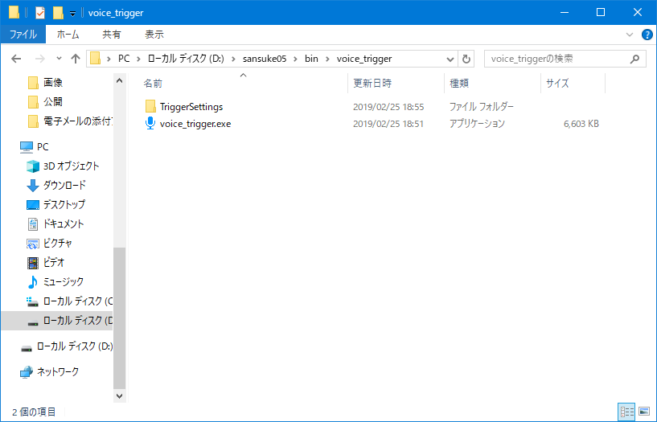
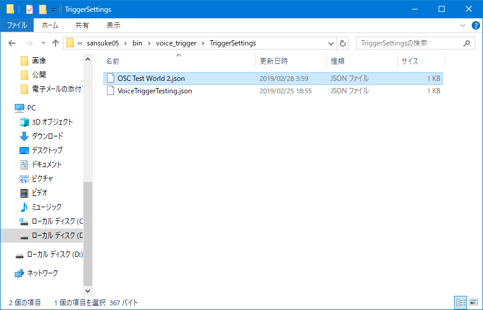
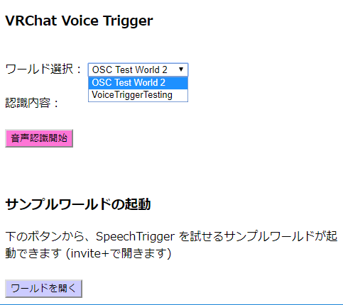
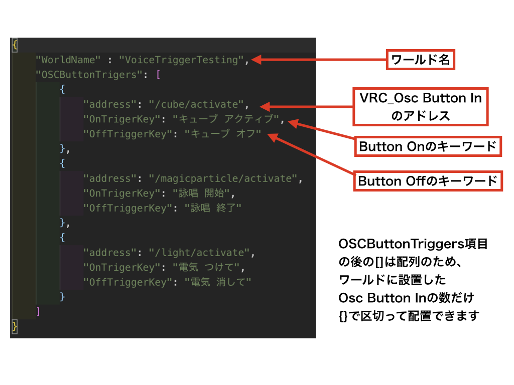

# VRChat Voice Trigger

<!-- vscode-markdown-toc -->
* 1. [注意事項](#)
* 2. [基本的な使い方](#-1)
* 3. [ワールドのVoiceTrigger設定データの導入](#VoiceTrigger)
* 4. [サンプルワールドについて](#-1)
* 5. [VRChat Voice Triggerの使えるワールドの制作について](#VRChatVoiceTrigger)
	* 5.1. [OSCメッセージを受信するワールドの制作](#OSC)
	* 5.2. [VoceTrigger設定データの作成方法](#VoceTrigger)
* 6. [免責事項](#-1)
* 7. [お知らせ](#-1)

<!-- vscode-markdown-toc-config
	numbering=true
	autoSave=true
	/vscode-markdown-toc-config -->
<!-- /vscode-markdown-toc -->

##  1. 注意事項

Google Chrome 以外のブラウザでは正しく動作しませんので使用する際は予めデフォルトのブラウザに Google Chrome を設定するようお願いします

##  2. 基本的な使い方

1. voice_trigger.exe を開きます

2. ブラウザが開いてwebページが表示されるのでワールド選択メニューから行きたいワールドを選択します

3. 「音声認識開始」ボタンを押します

4. VRChatで選択したワールドに移動し、ワールドに設定されたトリガーに対応した言葉を話すとワールドオブジェクトが反応します

##  3. ワールドのVoiceTrigger設定データの導入

デフォルトでは、デモワールドの設定データのみ入っていますが、自分でVoiceTriggerが使えるワールドを制作したり、他の人が作ったワールドのVoiceTriggerデータを導入する事で、そのワールドでVoiceTriggerを使えるようになります。

ワールドの制作方法や、VoiceTrigger設定データの制作方法については、**VRChat Voice Triggerの使えるワールドの制作について** をご覧下さい。ここではその設定データを導入する方法について記載します。

以下のように、VoiceTriggerを一度でも起動すると、アプリと一緒に「TeiggerSettings」フォルダが作成されます。

この「TeiggerSettings」フォルダの中に、「●●.json」形式のVoiceTrigger設定データを置きます。

この状態で voice_trigger.exe を起動するとwebページのワールド選択メニューに先ほどの設定データのワールド名が出てくれば、導入成功です。

##  4. サンプルワールドについて

- webページのワールド選択メニューから「VoiceTriggerTesting」ワールドを選択します。

- 「ワールドを開く」ボタンか[こちら](https://vrchat.com/home/world/wrld_5d9e20c4-b510-4c80-83d9-ac0f95596dd9)にアクセスしてサンプルワールドを開くか、私(VRCID:sansuke05)がサンプルワールド(VoiceTriggerTesting)を開いているときにjoinすることで VRChat Voice Trigger を体験していただくことができます。

##  5. VRChat Voice Triggerの使えるワールドの制作について

ここでは VRChat Voice Trigger の使えるワールドを制作する為の簡単な概要について記載します。

###  5.1. OSCメッセージを受信するワールドの制作

Voice Triggerを使えるワールドを制作するためには`VRChat SDK`の`VRC_OscButtonIn`を設定したワールドを制作します。

具体的な`VRC_OscButtonIn`とTriggerの設定方法については、じぇしかさんの[こちら](https://jscmla1118.hatenablog.com/entry/2018/11/10/184833)の記事の **OSCメッセージ受信側の実装** の箇所を参考に制作してみてください。

###  5.2. VoceTrigger設定データの作成方法

設定ファイルは右クリックして「プログラムから開く」からメモ帳などのテキストエディタで開く事で閲覧できます。

Voice Trigger 設定データは以下の画像のような構造になっています。

新しい設定データの作成手順は以下のようになります。

1. テキストエディタで新規ファイルを作成

2. 上記の画像を参考にして、対応した`VRC_Osc Button In`の項目と、Button On/Off時のキーワードを記載

3. ファイルを`(適当な名前).json`という形式で保存 (このとき、文字コードの項目を**UTF-8**を指定して保存する様にしてください。他の文字コードではプログラムが正常に読み取れません)

##  6. 免責事項

このソフトウェアを使用して生じたいかなる障害について、開発者であるサンスケ(sansuke05)は一切の責任を負いかねます。

##  7. お知らせ

プログラムの不具合、要望等については下記の連絡先までご連絡お願いします。

- Twitter: [@sansuke05_vr](https://twitter.com/sansuke05_vr)

- E-mail: sansuke05@gmail.com

- Github: [sansuke05](https://github.com/sansuke05)

- 個人discordサーバー: [キラキラママラボ](https://discord.gg/XYAcZhc)

また、このプログラムのソースコードは以下のサイトにてオープンソースで公開されています。(pull request等もお待ちしております(特にwebサイトのUI))

アプリ本体：https://github.com/sansuke05/VRC-voice-trigger-local-server (MITライセンス)

webページ：https://github.com/sansuke05/VRC-voice-trigger-web